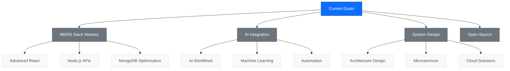

# Hi there 👋 It's me Haroon Ahmed

**Full Stack Developer Intern @ Marqwon**

<table>
<tr>
<td width="60%">

## About Me

- 🚀 Here's my [portfolio](https://haroonportfolio.wuaze.com)
- 📚 I'm currently learning and mastering **MERN Stack Development** and integrating AI to my workflow
- 💼 Engineering at **Marqwon** as Full Stack Developer Intern
- 🔨 Previously worked with **Maxyfi**
- 🎓 BCA in Data Science from Crescent University
- 🌍 Based in Chennai, Tamil Nadu, India
- 💡 Passionate about creating scalable web applications
- 🤖 Exploring AI/ML integration in web development

</td>
<td width="40%">

</td>
</tr>
</table>

## Current Focus Areas

## Social Presence

## 💻 I code in

### Languages

### Frontend Technologies

### Backend Technologies

### Databases

### Cloud & DevOps

## Tools & Technologies

## 💻 Workspace Spec

## 📊 GitHub Stats

<table>
<tr>
<td width="50%">

</td>
<td width="50%">

</td>
</tr>
</table>

## 📈 Contribution Graph

---

**Professional Contact:** haroonahmedthedev@gmail.com | **📱 WhatsApp:** +91-8838167503

### Show some ❤️ by starring some of the repositories!

